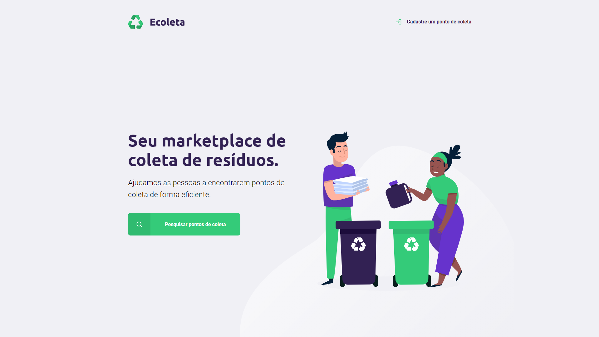
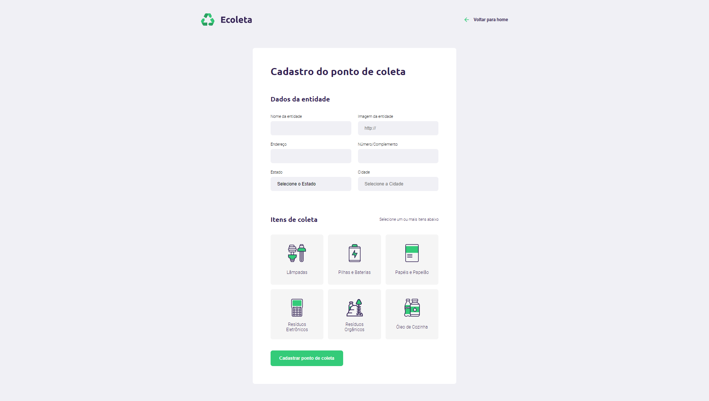
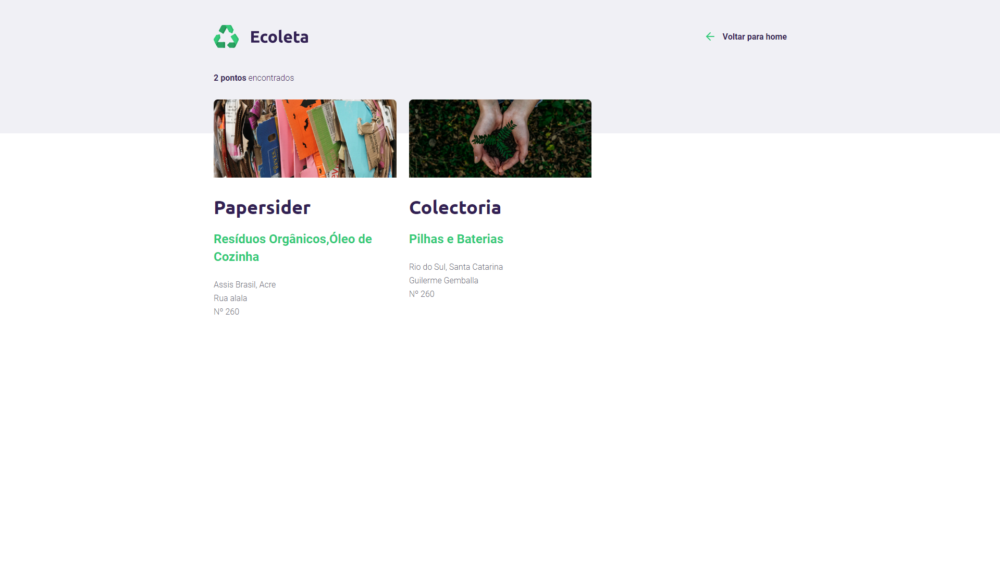

# 
Next Level Week #1

  

A <b>Next Level Week</b> é uma semana de muito aprendizado promovida pela Rocketseat.
 

  Na categoria _Starter_ aprendemos do zero como criar um aplicação web, passando pelo frontend: HTML, CSS e JavaScript
  até o backend: NodeJS, Express, Nunjucks e banco de dados relacionais (SQLite3).

 

  O projeto da vez é a Ecoleta: uma aplicação para cadastrar e buscar pontos de coleta de resíduos específicos e de tratamento especial.

# 
Página Inicial  

# 
Página de Cadastro de Ponto de Coleta  

# 
Página de Busca de Pontos de Coleta  

